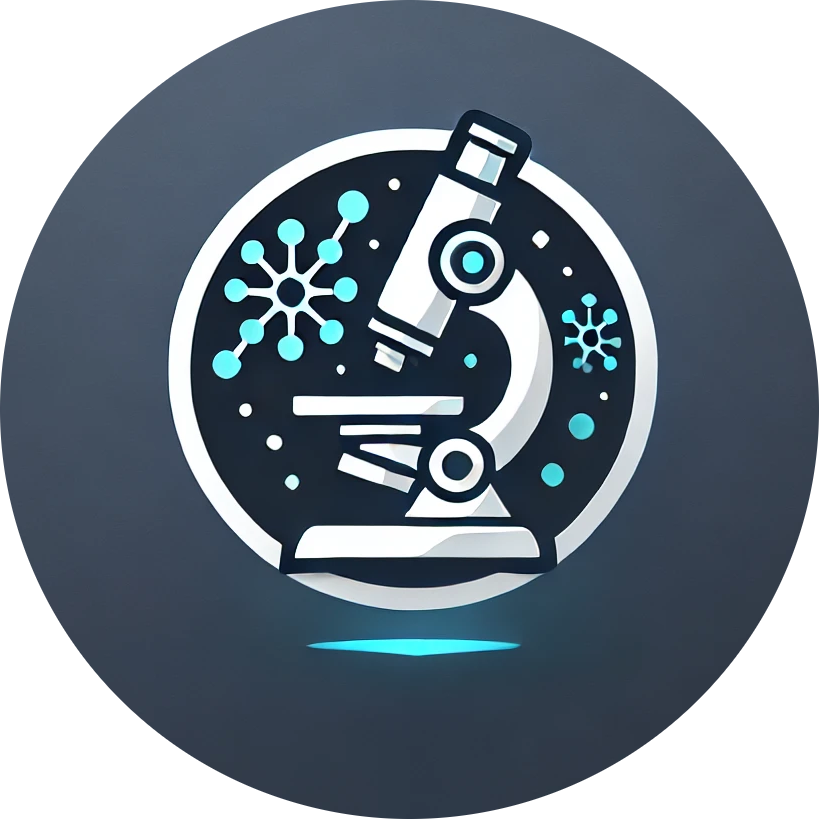
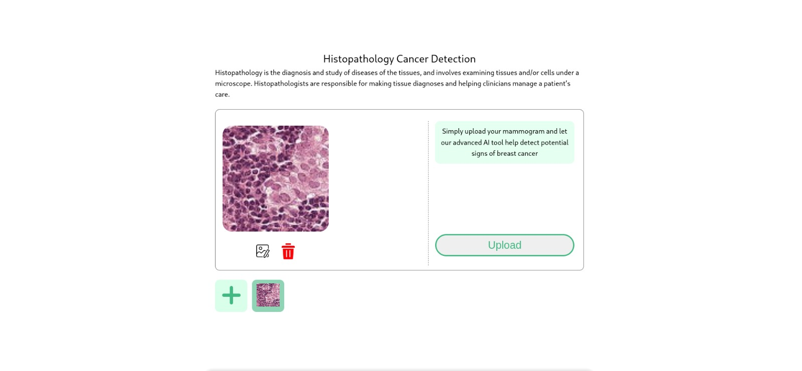
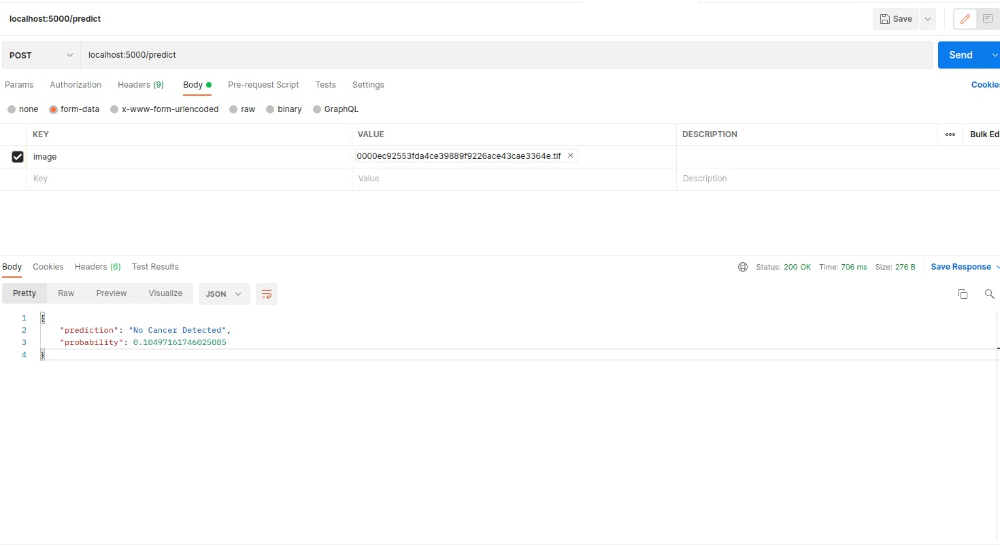

<h1 align="center">
  <br>
    
  <br>
  HistoScan
  <br>
</h1>

<div align="center">
    
    
    
    
    
    
</div>


<p align="center">
  <a href="#overview">Overview</a> •
  <a href="#model-architecture">Model Architecture</a> •
  <a href="#user-interface">User Interface</a> •
  <a href="#how-to-run">How To Run</a> •
  <a href="#api-endpoints">API Endpoints</a> •
  <a href="#contributions">Contributions</a>
</p>


## Overview

HistoScan is designed to streamline cancer diagnostics through advanced computer vision techniques. We have utilized the power of deep learning; our model is trained to accurately detect and classify cancerous tissues in histopathologic images. We used the Histopathologic Cancer Detection dataset from Kaggle,<a href = "https://www.kaggle.com/competitions/histopathologic-cancer-detection/data"> here </a>it is. This ensures a robust and diverse training set.
1. **The Problem**:
   - Manual Analysis: Time-consuming and prone to error.
   - High Volume of Data: Overwhelms healthcare professionals.
   - Need for Precision: Manual processes can delay accurate diagnosis.
   - Expertise Requirement: High-level expertise is not always available.
   
2. **Impact of the problem**:
   - Delayed Diagnosis: Manual analysis can delay diagnosis and treatment. 
   - Errors in Diagnosis: Human error may lead to misdiagnosis. 
   - Resource Strain: High demand for expert pathologists strains medical resources, especially in areas with limited access to specialized healthcare.
   

### Key Components:
- **Model**: Built on the ResNet-34 architecture (base model), fine-tuned for our specific use case, and trained using PyTorch.
- **Techniques**:
  - **Data Augmentation**: Applied transformations like rotation, scaling, and flipping to increase data diversity.
  - **Transfer Learning**: Utilized a pre-trained ResNet-34 model and fine-tuned it for cancer detection.
  - **Image Preprocessing**: Included resizing, cropping, and normalizing images to ensure consistency.
  - **Binary Classification**: Classified images as cancerous or non-cancerous.
- **Deployment**: The trained model is served using Flask, providing a simple and efficient API for real-time predictions.
- **User Interface**: Developed with Vue.js and Node.js, the UI allows users to upload images and receive instant diagnostic results.

This comprehensive approach not only improves the accuracy of cancer detection but also makes the tool accessible and easy to use for healthcare professionals.


## Model Architecture

The model base is a pretrained resnet34 model from [Deep Residual Learning for Image Recognition](https://arxiv.org/abs/1512.03385)

Resnet is a `Residual Learning Framework`, instead of optimizing weights that fit an underlying mapping, we optimize residual coefficients explain fit the same mapping.


Reason: 
  1.  won the 1st place in the ILSVRC2015 classification competition. 

  2. 1st places on: ImageNet detection, ImageNet localization,
  3. 1st place COCO detection, and COCO segmentation in ILSVRC &COCO 2015 competitions


The architecture doesn't suffer from degradation problem present in deep plain neural nets, but actually gains more accuracy with more layers


## User Interface

Here's how the interface looks like on our end:


### Technologies Used
- **Frontend**: Built with Vue.js to provide a dynamic and responsive user experience.
- **Backend**: Node.js was used to handle server-side operations and facilitate communication between the frontend and the model.

### Features
- **Image Upload**: Users can upload histopathologic images via the UI.
- **Real-time Prediction**: The uploaded images are sent to the backend, where the model processes the images and returns predictions in real-time.
- **Results Display**: The UI displays whether the image is classified as cancerous or non-cancerous along with the probability score.

### Observations
- **User Experience**: The interface is designed to be intuitive, ensuring ease of use for healthcare professionals.
- **Performance**: The real-time processing capability ensures quick feedback, which is crucial in medical diagnostics.


## How To Run

To clone and run this application, you'll need the following tools installed on your computer:
- [Git](https://git-scm.com)
- [Python](https://www.python.org/)
- [Node.js](https://nodejs.org/)

### Step 1: Clone this repository
```bash
git clone https://github.com/yourusername/HistoScan.git
```
### Step 2: Navigate into the project directory
```
cd HistoScan/model
```
### Step 3: Install backend dependencies
```
pip install -r requirements.txt
```
### Step 4: Install frontend dependencies
```
cd user_interface
```
```
npm install
```
### Step 5: Run the server
```
cd ..
```
```
python serve.py
```
### Step 6: Run the Vue development server
```
cd user_interface
```
```
npm run serve
```


## API Endpoint

Our endpoint looks like this, with the prediction and probability:



**Description**: Endpoint to predict if an uploaded histopathologic image is cancerous.
**Request**: Multipart form data with an image file.
**Response**: JSON containing the prediction and probability.

### API Overview

The api overview is explained below

```text
                                                                                                                                                                                                                                                                                                                     
 ┌──────────────────┐        ┌──────────────────┐     ┌─────────────────────────────────────────────┐                            
 │                  │        │                  │     │                                             │                            
 │                  │        │                  │     │                                             │                            
 │    IMAGE         │        │   Torch Model    │     │  {                                          │                            
 │    Served Via    ├───────►│                  ├─────┤      "prediction": "No Cancer Detected",    │                            
 │    REST API      │        │   1->Cancer      │     │      "probability": 0.10497161746025085     │                            
 │                  │        │   0 -> No cancer │     │  }                                          │                            
 │                  │        │                  │     │                                             │                            
 │                  │        │                  │     │                                             │                            
 └──────────────────┘        └──────────────────┘     └─────────────────────────────────────────────┘                                 
```


An image undergoes the following transofrmations to output
Normalization uses `mean=[0.485, 0.456, 0.406]` and `std=[0.229, 0.224, 0.225]` (similar to the Resnet Model)

```text
                                                                                                               
   ┌────────────────┐            ┌──────────────┐         ┌───────────────────┐       ┌─────────────────┐        
   │                │            │              │         │                   │       │                 │        
   │                │            │  TRANSFORM   │         │  PRETRAINED       │       │                 │        
   │  IMAGE         │            │ - RESIZE (256)         │  MODEL            │       │  OUTPUT         │        
   │                ├───────────►│              ┌─────────► - BASE (RESNET24) │       │                 │        
   │                │            │ - TOTENSOR() │         │                   │       │                 │        
   │                │            │ - NORMALIZE  │         │                   ├───────►                 │        
   │                │            │              │         │                   │       │                 │        
   └────────────────┘            └──────────────┘         └───────────────────┘       └─────────────────┘            
```


## Contributions


> GitHub [@nalugala-vc](https://github.com/nalugala-vc) &nbsp;&middot;&nbsp;
> GitHub [@fanisheba](https://github.com/nerdistry) &nbsp;&middot;&nbsp;
> GitHub [@etemesi254](https://github.com/etemesi254) &nbsp;&middot;&nbsp;
> GitHub [@some-casual-coder](https://github.com/some-casual-coder) &nbsp;


